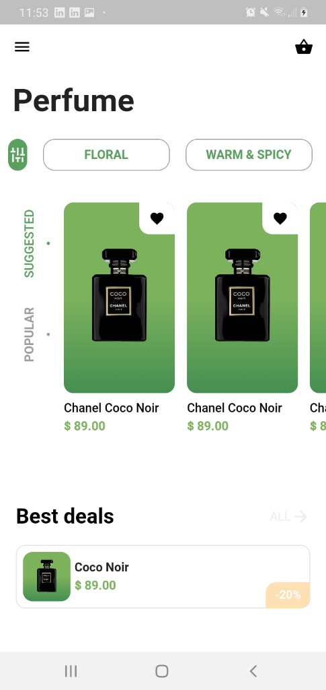

# Perfume Flutter UI challenge

A flutter UI challenge.

Mockup: https://dribbble.com/shots/8226522-Perfume-e-commerce-Mobile-App/attachments/596233?mode=media

## Result




## Requirements

## Used in the project

- [Flutter](https://flutter.dev/docs) -  https://flutter.dev/docs/get-started/install/windows 

## Clone the project

Use the command below:

```sh
git clone https://github.com/isabia/Flutter-UI-Challenge

### Install dependencies

```sh
flutter pub get```

### Run project

```sh
flutter run```
